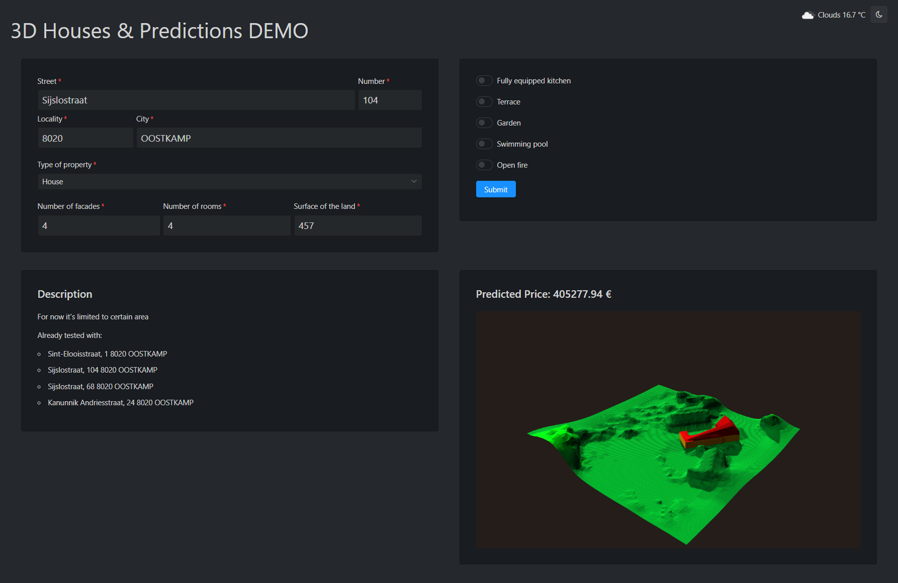

<!-- PROJECT LOGO -->
<br />
<p align="center">
  <a href="https://github.com/KeThien/3D-houses">
    
  </a>

  <h2 align="center">Project 3D Houses</h2>

  <p align="center">
    Machine Learning project: Real estate prediction with 3d Houses render from Lidar Data
    <br />
    <a href="#">View Demo</a>
  </p>
</p>


<!-- TABLE OF CONTENTS -->
<details open="open">
  <summary><h2 style="display: inline-block">Table of Contents</h2></summary>
  <ol>
    <li>
      <a href="#about-the-project">About The Project</a>
      <ul>
        <li><a href="#built-with">Built With</a></li>
      </ul>
    </li>
    <li>
      <a href="#getting-started">Getting Started</a>
      <ul>
        <li><a href="#prerequisites">Prerequisites</a></li>
        <li><a href="#installation">Installation</a></li>
      </ul>
    </li>
    <li><a href="#usage">Usage</a></li>
    <li><a href="#briefing">Briefing</a></li>
    <li><a href="#license">License</a></li>

  </ol>
</details>


<!-- ABOUT THE PROJECT -->
## About The Project




The project was about us learning Machine Learning implementation in Flask , extraction of Lidar DATA , Usage of the data and 3D rendering.
We focus only on a small part of the geolocation from the geotiff files because it was to big to handle in memory. But the project is scalable with the help of [Cloud Optimized GeoTIFF (COG)](https://www.cogeo.org/) 

### Built With

* [Docker](https://www.docker.com/)
* [Flask](https://flask.palletsprojects.com/)
* [Open3d](http://www.open3d.org/)
* [XGBoost](https://xgboost.readthedocs.io/en/latest/python/python_api.html)
* [Python](https://www.python.org/)


<!-- GETTING STARTED -->
## Getting Started

To get a local copy up and running follow these simple steps.

### Prerequisites

* data DSM DTM for the demo: [here](https://drive.google.com/file/d/1VslI3iD2n43o61dx5poL7zP4RIym7GDV/view?usp=sharing)
* [Docker](https://www.docker.com/)
* [Docker Compose](https://docs.docker.com/compose/install/)

### Installation

1. Clone the repo
   ```sh
   git clone git@github.com:KeThien/3D-houses.git
   ```
2. Extract the data in the project `3D-houses` folder


<!-- USAGE EXAMPLES -->
## Usage
All the packages python requirements are in requirements.txt
and is automatically installed with the docker-compose.yml file.

Launch docker compose
   ```sh
   docker-compose up
   ```
`docker-compose.yml`
  ```yml
  version: "3.9"
services:
  web:
    build: ./web
    command: flask run --host=0.0.0.0
    ports:
      - "5000:5000"
    volumes:
      - ./web:/app
      - ./geotif:/app/app/scripts/geotif/
      - ./predict_ML:/app/app/scripts/predict/

    deploy:
      restart_policy:
        condition: on-failure
        delay: 5s
        max_attempts: 3
        window: 120s
  ```
It will start the web service and the predict service from Flask
```
flask run
```


# Briefing
## 3D House Project

- Repository: `3D-houses`
- Type of Challenge: `Learning & Consolidation`
- Duration: `2 weeks`
- Deadline: `02/07/21 17:00 AM`
- Deployment strategy :
  - GitHub page
  - PowerPoint
  - Jupyter Notebook
  - Webpage
  - App
- Team challenge : `Team`

## Mission objectives

Consolidate the knowledge in Python, specifically in :

- NumPy
- Pandas
- Matplotlib

## Learning Objectives

- to be able to search and implement new libraries
- to be able to read and use the [shapefile](https://en.wikipedia.org/wiki/Shapefile) format
- to be able to read and use geoTIFFs
- to be able to render a 3D plot
- to be able to present a final product

## The Mission

> We are _LIDAR PLANES_, active in the Geospatial industry. We would like to use our data to launch a new branch in the insurance business. So, we need you to build a solution with our data to model a house in 3D with only a home address.

### Must-have features

- 3D lookup of houses.

### Nice-to-have features

- Optimize your solution to have the result as fast as possible.
- Features like the living area of the house in m², how many floors, if there is a pool, the vegetation in the neighborhood, etc...
- Better visualization.

### Miscellaneous information

#### What is LIDAR ?

LIDAR is a method to measure distance using light. The device will illuminate a target with a laser light and a sensor will measure the reflection. Differences in wavelength and return times will be used to get 3D representations of an area.

Here is a LIDAR segmentation :


With those points clouds we can easily identify houses, vegetation, roads, etc...

The results we're interested in are DSM (Digital Surface Map) and DTM (Digital Terrain Map).

Which are already computed and available here :

- [DSM](http://www.geopunt.be/download?container=dhm-vlaanderen-ii-dsm-raster-1m&title=Digitaal%20Hoogtemodel%20Vlaanderen%20II,%20DSM,%20raster,%201m)
- [DTM](http://www.geopunt.be/download?container=dhm-vlaanderen-ii-dtm-raster-1m&title=Digitaal%20Hoogtemodel%20Vlaanderen%20II,%20DTM,%20raster,%201m)

## Deliverables

1. Publish your source code on the GitHub repository.
2. Pimp up the README file:
   - Description
   - Installation
   - Usage
   - (Visuals)
   - (Contributors)
   - (Timeline)
   - (Personal situation)
3. Show us your results in a nice presentation.
4. Show us a live demo.

### Steps

1. Create the repository
2. Study the request (What & Why ?)
3. Download the maps
4. Identify technical challenges (How ?)

## Evaluation criteria

| Criteria       | Indicator                                                                   | Yes/No |
| -------------- | --------------------------------------------------------------------------- | ------ |
| 1. Is complete | There are no warnings/errors in the console.                                |        |
|                | You push your changes to GitHub at least once a day.                        |        |
|                | There is a visualization available for one house.                           |        |
| 2. Is great    | One can select an address and have the building at that address visualized. |        |
<!-- LICENSE -->
## License

Distributed under the MIT License. See `LICENSE` for more information.

